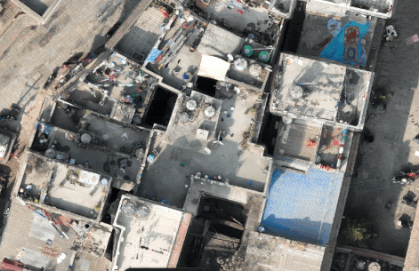

# README for Relative Digital Elevation Model Map Generation from GeoTIFF
## Overview
This script generates **depth maps** from **large (gigabytes) GeoTIFF orthophotos**  using **monocular vision**, a technique that estimates depth from a single image by leveraging spatial patterns and visual cues. It employs **sliding window processing** to handle large GeoTIFF files, producing a **GeoTIFF Digital Elevation Model (DEM)** as output.


### Example Output
Below is an example of a Digital Elevation Model (DEM) generated by the script:



### Large GeoTIFF Processing
This script is capable of processing large GeoTIFF files, as shown below:


## Development Setup

##### 1. Clone the Repository
```bash
git clone <repository-url>
cd <repository-directory>
```

##### 2. Use the provided environment.yml file to set up a Python environment:
```bash
conda env create -f environment.yml
```

##### 3. Activate the environment: 
```bash
conda activate relative-height-digital-elevation-model
```

##### 4. Download sample data
Download the required orthophoto data from here and place it in the data/orthophoto/ directory (or another directory of your choice).


## Generating Relative Digital Elevation Model
```bash
python scripts/generate_depth_map.py \
  --input_file data/orthophoto/small_dense_area.tif \
  --output_file data/dem/dem_small_dense_area.tif
```
### Optional Arguments
You can include additional arguments to customize the behavior of the script:

| Argument            | Default      | Description                                                        |
|---------------------|--------------|--------------------------------------------------------------------|
| `--model_type`      | `DPT_Large`  | Choose MiDaS model type. Options include `DPT_Large`, `DPT_Hybrid`.|
| `--window_size`     | `512`        | Define the size of the sliding window (in pixels).                 |
| `--overlap`         | `0.7`        | Set overlap ratio between patches (0 to 1).                       |
| `--show_output`     | `False`      | Add this flag to visualize the orthophoto and depth map side-by-side.|


# How to cite?
This is part of research project "Dense Urban Area Mapping" by Nishon Tandukar. 
If you use this code please cite. 

@misc{naxa_rh_dem,
  author = {Nishon Tandukar},
  title = {RH Digital Elevation Model Generator},
  howpublished = {\url{https://github.com/naxa-developers/rh-digital-elevation-model-generator}},
  note = {Accessed: 2024-11-18}
}
